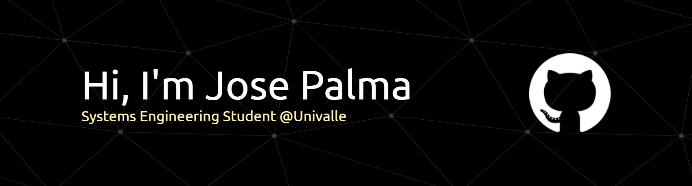

<!-- ESTO ES OTRA VERSION SIN IMAGEN, PODRIA USARSE -->

<!-- <h1 align="center"><b>Hi , I'm Jose Manuel Palma </b></h1>
<!--  -->

<!-- 

   -->
<!-- 
  -->

  

<!-- ABOUT ME -->

##  About Me

I'm a **Systems Engineering student at Universidad del Valle (Colombia)** with a strong interest in **web development and artificial intelligence**.

I enjoy building **clean, functional and scalable applications** that solve real-world problems, especially in **education and technology**.

##  Projects

  
  <!--  -->

